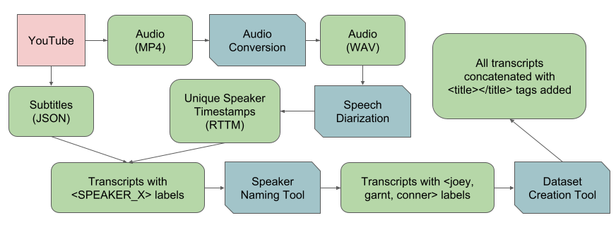

# Data Preprocessing



## Packages to install

```
pyannote.audio
python-dotenv
dotenv
pandas
numpy
tqdm
```

## Pipeline Description

1. `rename_files.py`: Removes unwanted characters from filenames.
2. `convert_to_wav.py`: Converts MP4 audio clips to WAV.
3. `identify_unique_speakers.py`: Perform speech diaraization. Outputs RTTM files with timestamps.
4. `annotate.py`: Combines the RTTM files and the JSON subtitles into our custom transcript format.
5. `name_speakers_tool.py`: Allows users to quickly rename each unique speaker with their actual name.
